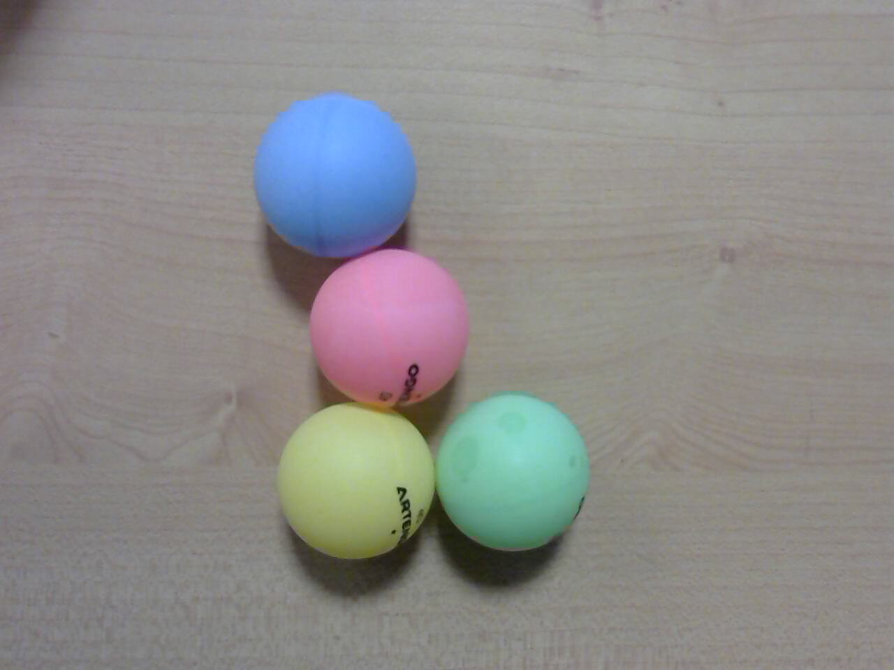

# TP Couleur

Vous devez traiter au moins jusqu’à la question 12, l’ensemble des comptes rendus est à rendre pour une semaine après le dernier TP. Le travail est à effectuer en binôme. Une séance plus un peu de temps en plus doit suffire. Les deux questions finales peuvent nécessiter beaucoup de temps mais sont optionnelles.  
Le travail est à faire en autonomie par binôme. Le but est de s’habituer à travailler en consultant des ressources pertinentes sur internet en cas de besoin.

## Objectif

On s’intéresse au tracking par un drone volant d'une boule de couleur, c'est-à-dire aux technologies permettant le comportement suivant :  
[Vidéo du comportement](https://www.youtube.com/watch?v=_3697dtyOz4)

Un fichier zippé `BallTracker.tar.gz` contient un exemple de code et un ensemble de vidéos. Le code est une version à peine modifiée du code suivant :  
[Exemple de code](https://github.com/simondlevy/OpenCV-Python-Hacks/blob/master/greenball_tracker.py)

## Question 1
Tester ce code avec Python V2 :

```bash
python balls_tracker.py
```
(Comme vous pouvez le constater, par défaut le code  utilise la vidéo ball.mp4 comme source d'entrée).
Quelle est votre conclusion sur le but de ce code ?

## Question 2

Proposez un code qui permet de choisir la couleur considérée parmi les 4 suivantes (bleu, rose, jaune ou vert)



Vous pourrez vous inspirer des documents suivants :

[Lien 1](https://docs.opencv.org/3.2.0/df/d9d/tutorial_py_colorspaces.html)

[Lien 2](https://stackoverflow.com/questions/10948589/choosing-correct-hsv-values-for-opencv-thresholding-with-inranges)

[Lien 3](https://www.learnopencv.com/color-spaces-in-opencv-cpp-python/)

Je vous propose aussi de regarder la vidéo suivante sur la représentation des couleurs 

[](https://www.youtube.com/embed/CF4wuPLBaAA?autoplay=1)


